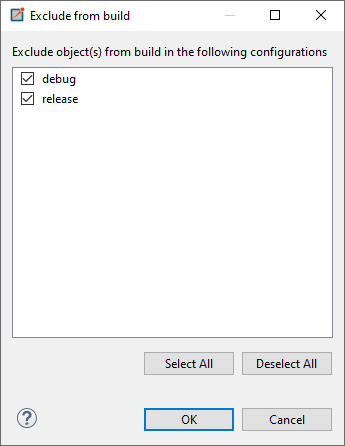
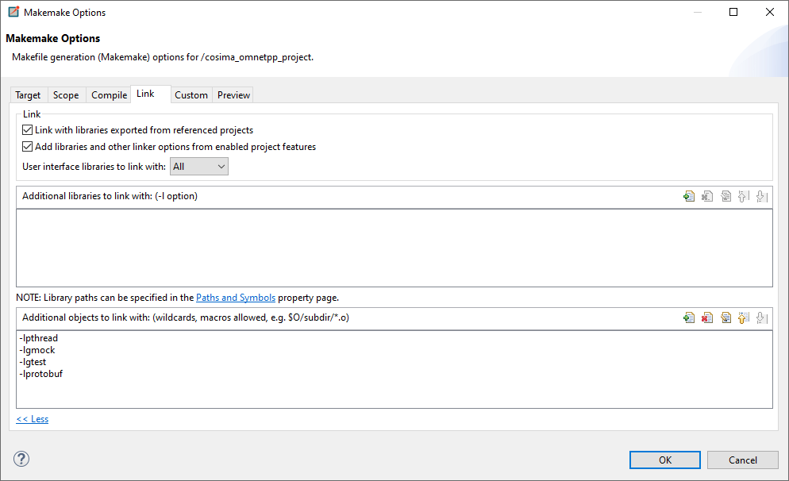

# cosima: Integration of the (communication) simulator OMNeT++ into agent communication
In this project we integrated the communication simulator OMNeT++ into a separate simulation to model communication
between software agents in multi-agent systems. 
This enables the simulation of realistic communication technologies (such as 5G) and the analysis of dynamic 
communication characteristics in Smart Grid scenarios.

The project originates from the OFFIS e.V. Institute of Information Technology in Oldenburg and the University of Oldenburg. 
For further information on cosima see [our website](https://cosima.offis.de/).

Originally, cosima was developed for integration into mosaik.

mosaik is a Smart Grid co-simulation framework developed by OFFIS e.V. in Oldenburg. For further information on mosaik
see [mosaik](https://mosaik.offis.de). OMNeT++ is a simulation framework for (communication) network simulation. For
further information on OMNeT++ see [OMNeT++](https://omnetpp.org/).

In addition, cosima provides a direct coupling to the agent framework [mango](https://gitlab.com/mango-agents).
This coupling can be used especially in scenarios in which the focus is on the high-performance simulation of agent 
behaviour under the influence of the underlying communication infrastructure.

This README contains the basic instructions on how to [install](#installation) cosima and 
how to [run the simulation](#run-simulation).
We recommend reading the detailed documentation on [ReadTheDocs](https://cosima.readthedocs.io).

## Installation

To use the project, an installation of mosaik (at least version 3.0), OMNeT++ and protobuf are required.

If you use Ubuntu in version 20.04: 
You can use the [Installation Shell Script](install-requirements.sh) via
```bash
chmod +x install-requirements.sh
sudo ./install-requirements.sh
```
for the installation tasks.
Otherwise, follow the following instructions.

### Installation of python packages

Use the package manager [pip](https://pip.pypa.io/en/stable/) to install the requirements.txt file.

```bash
pip install -r requirements.txt
```

### Installation and configuration of OMNeT++
In order to install OMNeT++ in version 5.6.2, go to their 
[website](https://github.com/omnetpp/omnetpp/releases/download/omnetpp-5.6.2/omnetpp-5.6.2-src-linux.tgz) and follow the 
instructions for your operating system.
In case that you are using Ubuntu (which is recommended), you can also execute the following commands: 

**Go to home directory**
```bash
cd ~
```
**Create working directory and enter directory**
```bash
mkdir -p omnetpp
cd omnetpp
```
**Fetch OMNeT++ source (in version 5.6.2)**
```bash
wget https://github.com/omnetpp/omnetpp/releases/download/omnetpp-5.6.2/omnetpp-5.6.2-src-linux.tgz
tar -xf omnetpp-5.6.2-src-linux.tgz
```
**Export path**
```bash
export PATH=$PATH:/usr/omnetpp/omnetpp-5.6.2/bin
```
**Configure and compile**
```bash
cd omnetpp-5.6.2
./configure PREFER_CLANG=yes
make
```
**Installation and configuration of INET**\
Install INET 4.2.2 from the OMNeT++ website [OMNeT++ INET](https://omnetpp.org/). 
The corresponding release can be found under this [link](https://github.com/inet-framework/inet/releases/download/v4.2.2/inet-4.2.2-src.tgz).

Again, under Ubuntu you can navigate to your preferred working directory and execute the following commands:
```bash
wget https://github.com/inet-framework/inet/releases/download/v4.2.2/inet-4.2.2-src.tgz
tar -xzf inet-4.2.2-src.tgz
rm inet-4.2.2-src.tgz
mv inet4 inet
cd inet
make makefiles
 ```
For the paths defined in the project to work correctly, inet and SimuLTE (optional, see below) should be in the project. 
This means that the folder structure should look something like this: 

**cosima**
- **cosima_core**
- **cosima_omnetpp_project**
- **data**
- **docs**
- **simulte**
- **inet4**
- **...**

If (for whatever reason) the projects are located in other places, the paths should be adjusted accordingly. 
Please adjust the `ned-path = ../simulte/src;.` in the [cosima.ini file](cosima_omnetpp_project/cosima.ini) and
your `INET_INSTALLATION_PATH` path in the [general_config](cosima_core/util/general_config.py).

After your installation, open the OMNeT++ IDE via
```bash
omnetpp
```
In the IDE, you can import the [OMNeT++ files](cosima_omnetpp_project) of this project as an Existing 
Project under\
_File->Import->General->Existing Projects_\
into Workspace.\
Then choose the INET installation directory as a project reference under\
_Project Properties -> Project References_\
in this project.

Now build your project:\
_Project->Build Project_


**(Optional) if you want to use LTE networks: Install SimuLTE 1.2.0** 
Install [SimuLTE in the correct version](https://github.com/inet-framework/simulte/releases/download/v1.2.0/simulte-1.2.0-src.tgz) 
and set the SimuLTE installation directory under\
_Project Properties -> Project References_\
in this project and re-build your project.

After installing all libraries check (and maybe adjust) the Makefile of the project.
Under

_Project Properties -> OMNeT++ -> MakeMake_\
adjust the makemakefile of the source folder ("src:makemake")
- under Target: set "Executable"
- under Scope: set "Deep Compile", "Recursive make" 
- under Compile: add path to INET installation and set "Add include Paths exported from referenced Projects"
- under Link: set both ticks. User interface libraries to link with: "all"

You should get a MakeMake option like 
```bash
--deep -I"C:\Users\user\Omnet-Projekt\inet" --meta:recurse --meta:use-exported-include-paths --meta:export-library --meta:use-exported-libs --meta:feature-ldflags
```

### Installation of protobuf

Install the protobuf compiler version 3.6.1 (on Ubuntu) via

```bash
sudo apt-get install libprotobuf-dev protobuf-compiler 
```

The used [protobuf message](cosima_core/messages/message.proto) is already compiled. 
However, errors may occur with the compiled file as it is system and version dependent.
Therefore, it is recommended to compile the files again.
If you want to compile the .proto file or another one use

```bash
protoc cosima_core/messages/message.proto --cpp_out=. --python_out=.
```


The output are the classes [message_pb2.py](cosima_core/messages/message_pb2.py) for python and message.pb.cc and message.pb.h for C++. Put
the C++ files in the [OMNeT++ messages folder](cosima_omnetpp_project/messages).

```bash
mv -t cosima_omnetpp_project/messages/ cosima_core/messages/message.pb.cc cosima_core/messages/message.pb.h
```

Now the generated files can be used in python via

```bash
from message_pb2 import InfoMessage
```

and in C++ via

```bash
#include "message.pb.h"
```

If the generated files should be used, in cosima_omnetpp_project/messages/message_pb2.cc, the include path for the
header-file needs to be changed from
```bash
#include "cosima_core/messages/message.pb.h"
```

to

```bash
#include "message.pb.h"
```

Now add the protobuf installation to your project in OMNeT++ under\
_Project Properties -> OMNeT++ -> MakeMake -> Options -> Link -> more -> additional objects to link with_\
add "-lprotobuf".

## Optional: PyTests

To set up testing in python follow these steps:

* in PyCharm under Settings -> Python Integrated Tools -> Testing set the Default Test Runner to PyTest
* tests can be found in the [test folder](tests). The structure of the test folder should correspond to the structure of
  the project
* test files start with "test_"
* to run a test execute either a single file or the folder

For further information see [info](https://semaphoreci.com/community/tutorials/testing-python-applications-with-pytest).

## Optional: Google-Test and Google-Mock
The process of testing is performed with the unit-testing Framework [Google Test](https://github.com/google/googletest/blob/main/googletest/README.md) with Google Mock. 
It is generally used to test different functionalities of the cosima project like the AgentApps, the MosaikScenarioManager or the Scheduler Module. 
Because the tests do not include the functionalities of the Networks itself, there is no need to execute them, when implementing a new Network. 
For this reason, the tests are excluded from being executed in OMNeT++ by default.

### Installing Google Test
The following commands can be used to install the Google Test framework under a Linux distribution.
Google Test must be installed, to run any of the tests but is not necessary to execute the project itself.
```bash
git clone https://github.com/google/googletest.git -b release-1.11.0
cd googletest
mkdir build
cd build
cmake ..
make
sudo make install 
```
or
```bash
sudo apt-get install googletest 
cd /usr/src/googletest   
sudo cmake CMakeLists.tx
sudo make
sudo make install
```

### Include the Tests and execute them
Executing the tests is possible by doing the following steps...

1. Including the tests folder
To perform Tests for the cosima project first you have to include them in the OMNeT++ Framework. 
To do so, right-click on the folder [tests](cosima_omnetpp_project/tests) and then go to Resource Configuration -> Exclude from Build. 
In the newly opened window you now can uncheck the boxes for the configuration, that you want to perform the tests on. 
By default, both the configuration for the debug and release mode should be checked.



2. Update dependencies
Next up we have to make sure, that the compiler uses the Google Test libraries, when executinmg the project. 
Under the Project Properties of our cosima_omnetpp_project, we have to click on OMNeT++ -> Makemake -> Options -> Link -> Additional objects to link with. 
Here you have to add the following dependencies (-lgmock -lgtest -lpthread). 
Now all that is left, is to rebuild the project and then executing it. The Tests should now be performed with the rest of the project.




## Run simulation
There exist different ways to run a simulation. In the [scenario configuration file](scenario_config.py), it is possible to choose from 'ide', 'qtenv' and 'cmd' as start mode.
* Ide: start the simulation in OMNeT++ by running [cosima.ini](cosima_omnetpp_project/cosima.ini) with your preferred network and 
  start the co-simulation in mosaik by running the [scenario](cosima_core/scenarios/communication_scenario.py) 
* Qtenv: start mosaik by running the [scenario](cosima_core/scenarios/communication_scenario.py). From within python, OMNeT++ will be started and a window will pop up in which
  the network can be chosen and the simulation can be started.
* Cmd: start mosaik by running the [scenario](cosima_core/scenarios/communication_scenario.py). OMNeT++ will be started automatically as a console application. 
**(note: This only works properly if the project is compiled with clang)**


Now, in order to start a simulation, you have two options.
You can either execute a scenario from the [scenarios folder](cosima_core/scenarios) or run the [run.py script](run.py)
with command line arguments.

### Executing a scenario file
Choose a scenario from the [scenarios folder](cosima_core/scenarios) and execute the main-method.
Make sure, that the base directory is the cloned repository folder. 

### Executing a scenario by command line
The [run.py script](run.py) script provides a flexible way to run different simulation scenarios using command-line 
arguments. 
It allows you to specify various parameters to customize the behavior of the simulation. 
Below are the steps to execute the [run.py script](run.py) script and run different scenarios.

To execute the `run.py` script, use the following command structure:

```bash
python run.py [-h] [-s SCENARIO] [-c COMMUNICATION_SIMULATION] [-e END] [-n NETWORK] [-a AGENTS] [-l LOGGING_LEVEL]
```

**Arguments**

- `-h, --help`: Show the help message and exit.
- `-s, --scenario`: Specify the name of the scenario you want to run. Available options are:
  - `communication_scenario`
  - `negotiation_scenario`
  - `mango_cohda_scenario`
  - `mango_simple_scenario`
  - `mango_units_scenario`
- `-c, --communication_simulation`: Set to `True` or `False` to enable or disable communication simulation.
- `-e, --end`: Specify the simulation end time in milliseconds.
- `-n, --network`: Specify the name of the network in OMNeT++.
- `-a, --agents`: Specify the number of agents in the simulation.
- `-l, --logging_level`: Specify the logging level (options: `debug`, `info`, `warning`).

**Example Usage**

1. Run the default scenario:
```bash
python run.py
```

2. Run a specific scenario with custom parameters:
```bash
python run.py -s mango_cohda_scenario -c True -e 10000 -n LargeLTENetwork -a 5 -l debug
```

**Note**

If you do not specify a scenario using the `-s` option, the script will default to the `communication_scenario`.
If you encounter any issues or errors, make sure you have provided valid values for the arguments.

**Simulation results**
* The exchanged messages are stored in folder results with timestamp of the simulation start as name of the csv-file.
For this, you may need to create a [results folder](cosima_core/results).