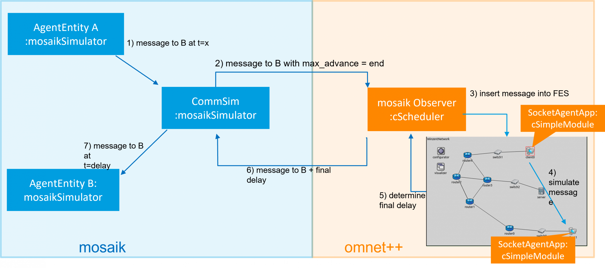

# Integration of the (communication) simulator OMNeT++ into the co-simulation framework mosaik

mosaik is a Smart Grid co-simulation framework developed by OFFIS e.V. in Oldenburg. For further information on mosaik
see [mosaik](https://mosaik.offis.de). OMNeT++ is a simulation framework for (communication) network simulation. For
further information on OMNeT++ see [OMNeT++](https://omnetpp.org/). In this project we integrated the communication
simulator OMNeT++ into the co-simulation framework mosaik in order to simulate communication delay in Smart Grid
scenarios. Therefore, two basic scenarios are provided.

## Installation

To use the project, an installation of mosaik3.0, OMNeT++ and protobuf is required.

### Installation of python packages

Use the package manager [pip](https://pip.pypa.io/en/stable/) to install the requirements.txt file.

```bash
pip install -r requirements.txt
```

### Installation and configuration of OMNeT++

* Install OMNeT++ version 5.6.2 from their website [OMNeT++](https://omnetpp.org/).
    - import the OMNeT++ files of this project [OMNeT++ files](mosaik_omnetpp_observer) as an Existing Project in
      OMNeT++
    - build the project
* Install INET 4.2.2 from the OMNeT++ website [OMNeT++ INET](https://omnetpp.org/).
    - set the INET installation under Project Properties -> Project References in this project
* (optional if you want to use LTE networks) install SimuLTE 1.1.0
    - set the SimuLTE installation under Project Properties -> Project References in this project
* adjust Makefile
    - under Project Properties -> OMNeT++ -> MakeMake adjust the Makemakefile of the source folder ("src:makemake")
      -- under Target: set "Executable"
      -- under Scope: set "Deep Compile", "Recourive make"
      -- under Compile: add path to INET installation and set "Add include Paths exported from referenced Projects"
      -- under Link: set both ticks. User interface libraries to link with: "all"
    - you should get a MakeMake option like --deep -I"C:\Users\user\Omnet-Projekt\inet" --meta:recurse --meta:
      use-exported-include-paths --meta:export-library --meta:use-exported-libs --meta:feature-ldflags

### Installation of protobuf

Install the protobuf compiler version 3.6.1 (on Ubuntu) via

```bash
sudo apt-get install libprotobuf-dev protobuf-compiler 
```

The used [protobuf message](message.proto) is already compiled. If you want to compile the .proto file or another one
use

```bash
protoc message.proto --cpp_out=. --python_out=.
```

The output are the classes [message_pb2.py](message_pb2.py) for python and message.pb.cc and message.pb.h for C++. Put
the C++ files in the [OMNeT++ folder](mosaik_omnetpp_observer).

Now the generated files can be used in python via

```bash
from message_pb2 import NegotiationMsg
```

and in C++ via

```bash
#include "message.pb.h"
```

Now add the protobuf installation to your project in OMNeT++ under Project Properties -> OMNeT++ -> MakeMake -> Options
-> Link -> more -> additional objects to link with add "-lprotobuf".

## Scenario

Two example scenarios are included in the project. These are structured very simply and are intended to illustrate the
functionality of the integration. On the mosaik side, agent simulators,
a [communication simulator](simulators/comm_simulator.py) and a
[collector](simulators/collector.py) are implemented. In OMNeT++ you find
the [MosaikObserver](mosaik_omnetpp_observer/MosaikObserver.h) which is responsible for message exchange with mosaik via
TCP socket. The [SocketAgentApp](mosaik_omnetpp_observer/SocketAgentApp.cc) and
[SocketAgentAppTcp](mosaik_omnetpp_observer/SocketAgentAppTcp.cc) represent the implementation of the application layer
(and transport layer) of the end devices, which represent the agents from mosaik on the OMNeT++ side. Example networks
can also be found in the project folder. The executable file in OMNeT++
is [mosaik.ini](mosaik_omnetpp_observer/mosaik.ini). The integration is shown schematically in: 
When an agent in mosaik sends a message to another agent, it does so through the agent simulator entities. Thus,
AgentEntityA sends a message to AgentEntityB at time t=x. However, this message is first received in the same step in
mosaik by the CommSim, which sends the message as a Protobuf object to OMNeT++ over a TCP connection. When the message
is sent, the simTime in mosaik and the value max_advance is passed from mosaik to OMNeT++. This value specifies how far
OMNeT++ may simulate until potentially new information could be available in mosaik. In OMNeT++ the message is received
by the MosaikObserver, which extracts the message content and inserts it as an event into the FES at the given simTime
from mosaik. In addition, the value of max_advance is also inserted as an event. Now OMNeT++ simulates the message
dispatch from client0 to client1 over the INET network. The resulting delay time is sent back to the MosaikObserver and
thus to mosaik. In mosaik the message is given to AgentEntityB after the determined end-to-end delay in OMNeT++.

It is possible to simulate the scenario with 2 - 20 agents. 
Furthermore, it is possible to simulate non-parallel and parallel message
sending behaviour. If parallel sending is simulated, two agents send messages simulaneously and time-shifted with 1 step difference.
It is also possible to add a PV plant to the simulation. PV plants can be connected to agents and read their current power values from
a given csv-file. Every 15 minutes, a new value is read and sent to the corresponding agent. The agent replies with an acknowledgement to 
this value.
Moreover, some changes in the infrastructure can be simulated. It is possible to set times for disconnects and reconnects for clients, routers
and switches.
In addition, long calculation times can be passed for the agents.
Multiple networks are implemented, for example to simulate TCP or UDP connections.

## Setup
Create a folder 'results' under mosaik-integration (mosaik-integration/results).
Before starting a simulation, choose simulation parameters:
- the used step size for the simulation (f.e. ms),
- the end time of the simulation,
- the number of agents,
- paths to store the simulation results and to load the content of the agent messages,
- the port to connect to OMNeT++,
- parallel or not,
- verbose or not to display information of the simulation run,
- the start mode,
- the simulated network, 
- agents to be connected to pv plants,
- infrastructure changes, 
- calculating times.


## Run simulation
There exist different ways to run a simulation. In the [config](config.py), it is possible to choose from 'ide', 'qtenv' and 'cmd' as start mode.
* Ide: start the simulation in OMNeT++ by running [mosaik.ini](mosaik_omnetpp_observer/mosaik.ini) with your preferred network and 
  start the co-simulation in mosaik by running the [scenario](comm_scenario.py) 
* Qtenv: start mosaik by running the [scenario](comm_scenario.py). From within python, OMNeT++ will be started and a window will pop up in which
  the network can be chosen and the simulation can be started.
* Cmd: start mosaik by running the [scenario](comm_scenario.py). OMNeT++ will be started automatically as a console application. 
**(note: This only works properly if the project is compiled with clang)**

Simulation results
* The exchanged messages are stored in folder results with timestamp of the simulation start as name of the csv-file.

## Optional: PyTests

To set up testing in python follow these steps:

* in PyCharm under Settings -> Python Integrated Tools -> Testing set the Default Test Runner to PyTest
* tests can be found in the [test folder](test). The structure of the test folder should correspond to the structure of
  the project
* test files start with "test_"
* to run a test execute either a single file or the folder

For further information see [info](https://semaphoreci.com/community/tutorials/testing-python-applications-with-pytest).

## Optional: clang-tidy and clang-format

clang-tidy and clang-formal are tools to clean up C++ code. To install, configure and use them do the following:

* choose the right version for your system on [installation page](https://apt.llvm.org/)
* run sudo apt-add-repository "<version>"
* run wget -O - https://apt.llvm.org/llvm-snapshot.gpg.key|sudo apt-key add -# Fingerprint: 6084 F3CF 814B 57C1 CF12
  EFD5 15CF 4D18 AF4F 7421
* run sudo apt-get update
* run sudo apt-get install clang-tidy-3.9
* navigate to the OMNeT++ folder
* generate a compilation database with clang++ -MJ compile_commands.o.json -Wall -std=c++11 -o <Dateipfad>.o
  -c <Dateipfad>.cpp
* generate a file with sed -e '1s/^/[\n/' -e '$s/,$/\n]/' *.o.json > compile_commands.json
* print all checks with clang-tidy-3.9 -checks=* -p ./ <Dateiname>.cc
* run sudo apt install clang-format-3.9
* run clang-format-3.9 -style=google <filename>.cc

## Optional: Testing-Framework Catch2 and Mocking Framework Fakeit

In the [test folder in OMNeT++](mosaik_omnetpp_observer/tests) are the single-header-files of Catch and Fakeit, which
need to be integrated in possible test files:

```
#define CATCH_CONFIG_MAIN
#include "catch.hpp"
#include "fakeit.hpp"
```

For further information see:

* [Catch2 Tutorial](https://github.com/catchorg/Catch2/docs)
* [Catch2 Tutorial](https://mariusbancila.ro/blog/2018/03/29/writing-cpp-unit-tests-with-catch2/)
* [Catch2 Tutorial](https://www.jetbrains.com/help/clion/unit-testing-tutorial.html#catch-framework)
* [Fakeit Tutorial](https://github.com/eranpeer/FakeIt)