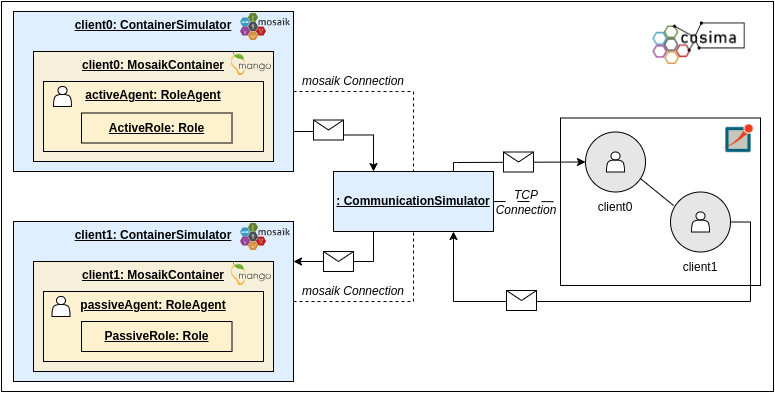
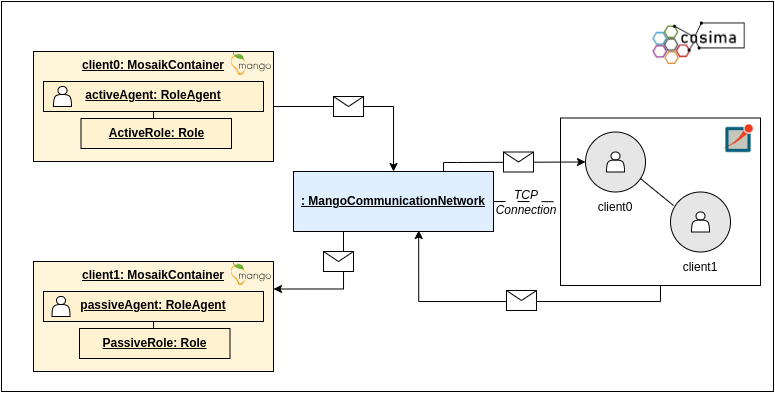

# Coupling with the agent framework mango

[The mango agent framework](https://gitlab.com/mango-agents) is designed to provide a seamless experience for creating 
agents with varying levels of complexity. 
It offers both simplicity for quickly building simple agents and flexibility for structuring agents with complex behaviors.
With straightforward APIs and easy-to-understand documentation, users can quickly define basic agent behaviors and rules. 
This allows for the rapid deployment of agents that can perform essential tasks and make straightforward decisions within the energy system.

Since power systems are safety-critical systems, it is essential to evaluate the robustness and reliability of control 
mechanisms under restricted communication before they are deployed.
For this reason, cosima was coupled with mango. 
This allows the simulation of the information exchange via communication between the mango agents in OMNeT++. 

cosima provides two types of coupling with mango. On the one side, it is possible to couple mosaik with OMNeT++ and 
mango and on the other side, mango can be coupled directly with OMNeT++ in order to simulate agent communication in a
communication simulation. 

## Coupling of mango with OMNeT++ via mosaik

The files required for coupling mango with the co-simulation framework mosaik can be found in the following directories: 
- simulators: `cosima_core/simulators/mango_example`
- scenarios: `cosima_core/scenarios/mango_example`

As shown in the figure above, the container simulator provided by cosima encapsulates a mango container with a mango agent
and is connected to the CommunicationSimulator for communication simulation. 
When initializing the scenario, roles can be passed for the agents, defining their properties and behaviors. 
The [mango tutorial](Tutorial.rst) shows the simple application of the coupling. 

## Direct coupling of mango with OMNeT++
In the scenario folder `cosima_core/scenarios/mango` we also provide scenarios that use the direct coupling of mango with
OMNeT++. These scenarios include a **simple scenario** in `cosima_core/scenarios/mango/mango_direct_connection_scenario.py`
and a scenario including a **negotiation with COHDA** in `cosima_core/scenarios/mango/mango_direct_connection_cohda_scenario.py`.
The implementation of the interface between mango and OMNeT++ may be found in 
`cosima_core/mango_direct_connection/mango_communication_network.py`.

The image below shows the architecture of the direct coupling. The main difference here is, that mosaik is not included 
in the simulation. As an interface between mango and OMNeT++ the `MangoCommunicatioNetwork` is used, that needs to be
initialised in the according scenario file. 

### The MangoCommunicationNetwork
The `MangoCommunicationNetwork` class represents a communication network based on a simulated network in OMNeT++ 
using the messages from the agent framework mango. 
It sets up the connection with OMNeT++ network, manages message passing between components, 
and interacts with an OMNeT++ simulation.

The method `_start_scenario` starts the communication network in the agent-system scenario. 
It initializes the scenario by sending an initial message to OMNeT++, performing the initial steps, 
and running the scenario loop.

In `run_scenario` the communication network simulation scenario loop is ran. 
The methods continuously processes received messages, performs container steps, handles synchronization, 
and sends messages to OMNeT++.

The method `step_mango_containers` steps through mango containers, processes received outputs, 
and updates next activities. It iterates over the containers in the network, processes received messages for each 
container, and updates the next activities list accordingly.

The method `process_mango_outputs` processes the mango outputs from a container. 
It generates message dictionaries from the output of a MosaikContainer's step and adds them to the message buffer.

The `handle_synchronization_with_waiting_messages` method handles synchronization with OMNeT++ by sending waiting 
messages if conditions are met. It checks conditions for sending a waiting message to synchronize simulation components.

The method `waiting_for_messages_from_omnetpp` checks if the instance is waiting for messages from OMNeT++. 
It compares the number of messages sent with the number of messages received to determine if there 
are more messages to expect from OMNeT++.

The method `send_messages_to_omnetpp` sends messages from the message buffer to OMNeT++. 
It also handles synchronization messages if required.