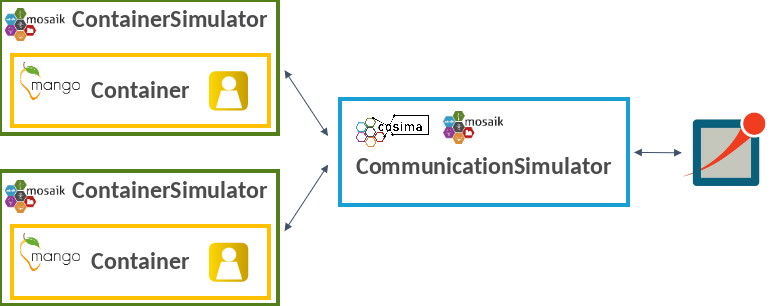

# Coupling with the agent framework mango

[The mango agent framework](https://gitlab.com/mango-agents) is designed to provide a seamless experience for creating 
agents with varying levels of complexity. 
It offers both simplicity for quickly building simple agents and flexibility for structuring agents with complex behaviors.
With straightforward APIs and easy-to-understand documentation, users can quickly define basic agent behaviors and rules. 
This allows for the rapid deployment of agents that can perform essential tasks and make straightforward decisions within the energy system.

Since power systems are safety-critical systems, it is essential to evaluate the robustness and reliability of control 
mechanisms under restricted communication before they are deployed.
For this reason, cosima was coupled with mango. 
This allows the simulation of the information exchange via communication between the mango agents in OMNeT++. 

The files required for coupling Mango with the co-simulation framework can be found in the following directories: 
- simulators: `cosima_core/simulators/mango_example`
- scenarios: `cosima_core/scenarios/mango_example`

As shown in the figure above, the container simulator provided by cosima encapsulates a mango container with a mango agent
and is connected to the CommunicationSimulator for communication simulation. 
When initializing the scenario, roles can be passed for the agents, defining their properties and behaviors. 
The [mango tutorial](Tutorial.rst) shows the simple application of the coupling. 