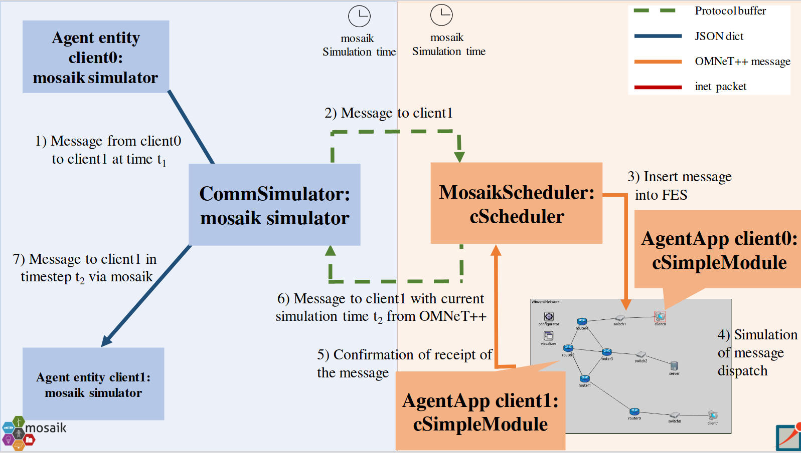

# Overview

To get started with cosima, we have included an examplary (yet already quite complicated) scenario ([communication scenario](https://github.com/OFFIS-cosima/cosima/blob/master/cosima_core/communication_scenario.py)). 
This can be used to reconstruct the coupling between OMNeT++ and mosaik. 
The communication scenario can be configured by the [scenario configuration file](https://github.com/OFFIS-cosima/cosima/blob/master/scenario_config.py).
The general idea and the configuration of scenarios are described in the following sections. \
However, there are detailled descriptions available for the general scenario configuration and synchronisation in [Scenarios](Scenarios.md), 
[Synchronization](Synchronization.md) and [MessageTypes](MessageTypes.md). \
The components of mosaik are described in [CommunicationSimulator](CommunicationSimulator.md) and [ICT-Controller](ICTController.md). \
The components of OMNeT++ are described in  [Networks](Networks.md), [MosaikScheduler](MosaikScheduler.md) and [AgentApps](AgentApps.md). 


## General Simulation Architecture
cosima consists of a mosaik and an OMNeT++ side.
On the mosaik side, agent simulators,
a [communication simulator](https://github.com/OFFIS-cosima/cosima/blob/master/cosima_core/simulators/communication_simulator.py) and a
[collector](https://github.com/OFFIS-cosima/cosima/blob/master/cosima_core/simulators/collector.py) are implemented. In OMNeT++ you find
the [MosaikScheduler](https://github.com/OFFIS-cosima/cosima/blob/master/cosima_omnetpp_project/modules/MosaikScheduler.h) which is responsible for message exchange with mosaik via
TCP socket. The [AgentApp](https://github.com/OFFIS-cosima/cosima/blob/master/cosima_omnetpp_project/modules/AgentAppUdp.cc) and
[AgentAppTcp](https://github.com/OFFIS-cosima/cosima/blob/master/cosima_omnetpp_project/modules/AgentAppTcp.cc) represent the implementation of the application layer
(and transport layer) of the end devices, which represent the agents from mosaik on the OMNeT++ side. Example networks
can also be found in the project folder. The executable file in OMNeT++
is [mosaik.ini](https://github.com/OFFIS-cosima/cosima/blob/master/cosima_omnetpp_project/mosaik.ini). 
The integration is shown schematically in: 
When an agent in mosaik sends a message to another agent, it does so through the agent simulator entities. Thus,
client0 sends a message to client1 at time t1. However, this message is first received in the same step in
mosaik by the CommunicationSimulator, which sends the message as a Protobuf object to OMNeT++ over a TCP connection. When the message
is sent, the simTime in mosaik and the value max_advance is passed from mosaik to OMNeT++. This value specifies how far
OMNeT++ may simulate until potentially new information could be available in mosaik. In OMNeT++ the message is received
by the MosaikScheduler, which extracts the message content and inserts it as an event into the FES at the given simTime
from mosaik. In addition, the value of max_advance is also inserted as an event. Now OMNeT++ simulates the message
dispatch from client0 to client1 over the INET network. The resulting delay time is sent back to the MosaikScheduler and
thus to mosaik. In mosaik the message is given to client1 after the determined end-to-end delay in OMNeT++.


## Configure a Scenario
In the following, the simulations are described (see also [Scenarios](Scenarios.md) ), which can be performed by adapting the aforementioned [scenario configuration file](https://github.com/OFFIS-cosima/cosima/blob/master/scenario_config.py).
From the given networks it is possible to simulate the scenario with more than 2 agents (limited by the amount of clients in the selected OMNeT++ Network). If a correspondingly larger network 
is modeled, larger agent numbers are also possible.  
Furthermore, it is possible to simulate non-parallel and parallel message
sending behaviour. If parallel sending is simulated, two agents send messages simultaneously and time-shifted with 1 step difference.
It is also possible to add a PV plant to the simulation. PV plants can be connected to agents and read their current power values from
a given csv-file. Every 15 minutes, a new value is read and sent to the corresponding agent. The agent replies with an acknowledgement to 
this value.
Moreover, some changes in the infrastructure can be simulated. It is possible to set times for disconnects and reconnects for clients, routers
and switches.
In addition, long calculation times can be passed for the agents.
Multiple networks are implemented, for example to simulate TCP or UDP connections.

### Configuration Steps and Parameters
Create a folder 'results' under mosaik-integration (mosaik-integration/results).
Before starting a simulation, choose simulation parameters:
- the used step size for the simulation (f.e. ms),
- the end time of the simulation (therefore the simulation duration),
- the number of agents,
- paths to store the simulation results and to load the content of the agent messages,
- the port to connect to OMNeT++,
- parallel or not,
- verbose or not to display information of the simulation run,
- the start mode,
- the simulated network, 
- agents to be connected to pv plants,
- infrastructure changes, 
- calculating times
- time-based or not (default is not time-based, as this is more performant).


## Run simulation
There exist different ways to run a simulation. In the [scenario configuration file](https://github.com/OFFIS-cosima/cosima/blob/master/scenario_config.py), it is possible to choose from 'ide', 'qtenv' and 'cmd' as start mode.
* Ide: start the simulation in OMNeT++ by running [mosaik.ini](https://github.com/OFFIS-cosima/cosima/blob/master/cosima_omnetpp_project/mosaik.ini) with your preferred network and 
  start the co-simulation in mosaik by running the [scenario](https://github.com/OFFIS-cosima/cosima/blob/master/cosima_core/communication_scenario.py) 
* Qtenv: start mosaik by running the [scenario](https://github.com/OFFIS-cosima/cosima/blob/master/osima_core/communication_scenario.py). From within python, OMNeT++ will be started and a window will pop up in which
  the network can be chosen and the simulation can be started.
* Cmd: start mosaik by running the [scenario](https://github.com/OFFIS-cosima/cosima/blob/master/cosima_core/communication_scenario.py). OMNeT++ will be started automatically as a console application. 
**(note: This only works properly if the project is compiled with clang)**

Simulation results
* The exchanged messages are stored in folder results with timestamp of the simulation start as name of the csv-file.

## Modelling a new network in OMNeT++
All of the provided [networks](https://github.com/OFFIS-cosima/cosima/blob/master/cosima_omnetpp_project/networks) contain an instance of the 
*[MosaikSchedulerModule](https://github.com/OFFIS-cosima/cosima/blob/master/cosima_omnetpp_project/modules/MosaikSchedulerModule.h)*. 
When modeling an additional network, this module must also be inserted into the network to enable the 
*[MosaikScheduler](https://github.com/OFFIS-cosima/cosima/blob/master/cosima_omnetpp_project/modules/MosaikScheduler.h)* to operate. \
In addition, an instance of the *[MosaikScenarioManager](https://github.com/OFFIS-cosima/cosima/blob/master/osima_omnetpp_project/modules/MosaikScenarioManager.h)* 
should be inserted into the network if changes on the infrastructure (for example disconnecting or reconnecting clients) 
should be possible at simulation time. \
The network description file (.ned file) of a network in OMNeT++ should contain the following: 
```bash
import MosaikSchedulerModule;
import MosaikScenarioManager;

  scenarioManager: MosaikScenarioManager {
        }

  schedulerModule: MosaikSchedulerModule {
        }
```
If a new .ini-file in OMNeT++ is created, the scheduler class must be registered in the .ini-file of the OMNeT++-project.\
``
[General] 
``\
``
scheduler-class = "MosaikScheduler"
`` 
