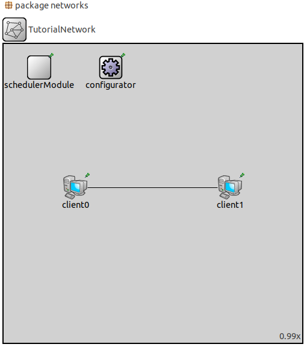
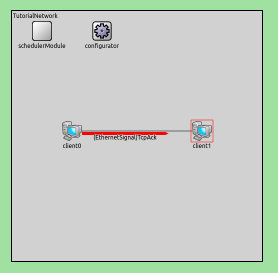

=========
Tutorial
=========

.. _cosima gitlab repository: https://gitlab.com/mosaik/examples/cosima
.. _OMNeT’s website: https://docs.omnetpp.org/tutorials/tictoc/

In this tutorial, you will be guided through a simple example, on how cosima integrates the (communication) simulator OMNeT++ into the co-simulation framework mosaik.
The goal is to provide a basic understanding of how agents communicate with the simulation, as well as showing how agents are connected to mosaik through a simple scenario.

This example is based on the tutorial scenario, that you can find under ``cosima_core/tutorial_scenario.py`` in the official `cosima gitlab repository`_.
If you just want to try out, if you successfully installed cosima and all of its dependencies, you can run ``tutorial_scenario.py`` after starting the corresponding OMNeT++ Simulation.

However, this requires a basic understanding of how ONNeT++ works.
Therefore, it is recommended, that new users first try out the TicToc example from `OMNeT’s website`_.
Additionally, this tutorial will later provide an optional part, that will focus on the configuration and creation of a simple network, that can be used to test our scenario.
In addition to knowledge of OMNeT++, it is advised to have a basic understanding of the programming language python.

Create a simple Agent
======================

Initialization
---------------
The Process of managing messages is realised by entities of agents.
That means, to send and receive messages, we first have to create an agent, that is capable of doing so.
To do that, first create a python file under ``cosima_core/simulators`` named ``agent_simulator.py``.
Next put the following lines into that file:

.. code-block:: python
    :linenos:

    import mosaik_api

    META = {
        'api_version': '3.0',
        'type': 'event-based',
        'models': {
            'SimpleAgentModel': {
                'public': True,
                'params': [],
                'attrs': ['message'],
            },
        },
    }

    class SimpleAgent(mosaik_api.Simulator):
        def __init__(self):
            super().__init__(META)
            self._sid = None
            self._client_name = None
            self._msg_counter = 0
            self._outbox = []
            self._output_time = 0
            self._neighbor = None
            self._connection_attr = None

        def init(self, sid, **sim_params):
            self._sid = sid
            self._connection_attr = sim.params.get(“connect_attr”)
            if 'client_name' in sim_params.keys():
                self.meta['models']['SimpleAgentModel']['attrs'].append(f'{self.connect_attr}{sim_params["client_name"]}')
                self._client_name = sim_params['client_name']
            if 'neighbor' in sim_params.keys():
                self._neighbor = sim_params['neighbor']
            return META

.. _mosaik simulator: https://mosaik.offis.de/docs/

Inside the file, we first must make sure that we include the mosaik api, because the agent is based on an `mosaik simulator`_.
The variable META defines the general information about the agent.
The string api_version defines which version of mosaik is used for the agent. For this Tutorial version 3.0 is used.
The type specifies, how the simulator advances through time.
In cosima this will be event-based. The model is defined with a simple attribute to store messages.

The variables in the ``__init__`` are storing the following data:

.. note::

    sid = ID of the simulation

    client_name = name of the agent in the scenario

    msg_counter = counts the number of messages send

    outbox = stores the messages

    output_time = time where the message got send

    neighbor = Reciever of the message

    connection_attr = attribute which is exchanged between CommunicationSim and Agents

The ``init()`` Method initializes the simulator with the corresponding ID and simulation parameters, that are sent by mosaik.

The step method
----------------
The step method is called every time the next step for a given time should be performed.
But before we can step an agent, we have to create a number of instances of the given model.
To do that, insert the following method into the python file.

.. code-block:: python
    :linenos:

    def create(self, num, model, **model_conf):
        return [{'eid': self._sid, 'type': model}]

The Method gets the number of models as well as its parameters and returns a list of dictionaries, each with their own entity ID (eid).

Now we can implement the actual ``step`` method:

.. code-block:: python
    :linenos:

    def step(self, time, inputs, max_advance):
        log(f'{self._client_name} received input {inputs}')
        content = 'Hi neighbor!'
        self._outbox.append({'msg_id': f'{self._client_name}_{self._msg_counter}',
                             'max_advance': max_advance,
                             'sim_time': time + 1,
                             'sender': self._client_name,
                             'receiver': self._neighbor,
                             'content': content,
                             'creation_time': time,
                             })
        self._msg_counter += 1
        self._output_time = time + 1
        return None

For our simple simulation, we just want the agent to queue the message “Hi neighbor” to another participant, whenever he steps.
To do that, we just append our message, that we defined in the variable content, within a dictionary, to the agent’s outbox.
The dictionary contains all the important information, that the simulation needs to send the message to the right client.
The variable max_advance sets a time boundary of how far the simulation can advance, without going out of sync with the OMNeT++ Simulation component.
That means, that no external step, will be performed within the given timeframe.

To inform the user when a message is sent, we additionally use a helper function, that is implemented in cosima.
To import it, you can simply add the following line, to the top, of the file:

.. code-block:: python
    :linenos:

    from cosima_core.util.util_functions import log

Next up is a function called ``get_data``. The function collects the messages in the outbox, so that they can be send by mosaik.

.. code-block:: python
    :linenos:

    def get_data(self, outputs):
        data = {}
        if self._outbox:
            data = {self._sid: {f'message': self._outbox}, 'time': self._output_time}
            self._outbox = []
        return data

The last function, that we going to use in our sample agent, is called finalize.
Normally this function is used, to clean up external processes.
However, in our case that is not necessary, so we just use it to print the information, that the agent is finished, on the console with our log function.

.. code-block:: python
    :linenos:

    def finalize(self):
        log('Finalize SimpleAgent')

With this, we now have a simple agent, that can send a basic string as a message.
Next, we are going to implement a little scenario, that uses this agent.

Download File: :download:`agent_simulator.py <downloads/agent_simulator.py>`

Build a basic scenario
=======================

Configuration and Parameters
-----------------------------

Now that we got our agent, we can use it in a simple scenario, that will create two entities of that agent as so-called clients.
By the end of the simulation, these clients will both send a message to one another, with our defined content.
First up we will demonstrate, how to configure our simulation and what parameters to set.
To do that create a new file called ``tutorial_scenario.py`` in the ``cosima_core`` directory and copy these lines into it:

.. code-block:: python
    :linenos:

    PORT = 4242
    SIMULATION_END = 10
    START_MODE = 'cmd'
    NETWORK = 'TutorialNetwork'

    SIM_CONFIG = {
        'SimpleAgent': {
            'python': 'cosima_core.simulators.tutorial.simple_agent_simulator:SimpleAgent',
        },
        'CommunicationSimulator': {
            'python': 'cosima_core.simulators.communication_simulator:CommunicationSimulator',
        }
    }

The Variable ``PORT`` must be set to 4242, to connect the mosaik-scenario correctly to OMNeT++.
``SIMULATION_END`` defines the maximum time; the simulation can run.
For the ``START_MODE`` we have 3 viable options. If we set it to “ide”, we must run the OMNeT++ simulation separately before running the scenario.
If the mode “qtenv” is used, the OMNeT++ Simulation window will start automatically when running the scenario.
For now, we will set the start mode to “cmd” that will start the OMNeT++ simulation directly in the command line.
The variable ``NETWORK`` sets what network inside of the OMNeT++ Simulation will be used.
At last, we will define, what simulators (or Agents in our case) will be used and were to find them, with the variable ``SIM_CONFIG``.

Now that our simulation parameters are set, we next have to connect our scenario to OMNeT++ with the following lines:

.. code-block:: python
    :linenos:

    from cosima_core.util.util_functions import start_omnet, \
        check_omnet_connection, stop_omnet, \
        log
    omnet_process = start_omnet(START_MODE, NETWORK)
    check_omnet_connection(PORT)

Running this file, now should print a statement onto the console, that confirmes a positive connection to OMNeT++ like this:

.. code-block:: console
    :linenos:

    mosaik: 02:37:02:623449 Connection to OMNeT++ possible: True

Connection to agents and mosaik
--------------------------------

In this step, we will implement the actual mosaik simulation.
We start by creating the mosaic World as well as mapping the attributes of our two clients:

.. code-block:: python
    :linenos:

    import mosaik

    world = mosaik.World(SIM_CONFIG, debug=True, time_resolution=0.001, cache=False)

    client_attribute_mapping = {
        'client0': 'message_with_delay_for_client0',
        'client1': 'message_with_delay_for_client1'
    }

With this, now both simulations can be running simultaneously and in sync.
Now we can add and start our clients by instantiate our agents:

.. code-block:: python
    :linenos:

    simple_agent_1 = world.start('SimpleAgent',
                                 client_name='client0',
                                 neighbor='client1'
                                 connection_attr=’message_with_delay_for_’).SimpleAgentModel()

    simple_agent_2 = world.start('SimpleAgent',
                                 client_name='client1',
                                 neighbor='client0'
                                 connection_attr=’message_with_delay_for_’).SimpleAgentModel()

    comm_sim = world.start('CommunicationSimulator',
                           step_size=1,
                           port=4242,
                           client_attribute_mapping=client_attribute_mapping).CommunicationModel()

This will call the ``create`` and ``init`` functions, we created in our agent implementation and thereby setting up the clients with our defined messages.
Even though we just want to use our two clients in our scenario, we actually have to set up one more Simulator, the so called CommunicationSimulator.
The CommunicationSimulator synchronizes the schedulers between OMNeT++ and mosaik and manages the step methods for the other simulators.
Therefore, it is essential to add it to our simulation above the world.connect statements, that are implemented as followed:

.. code-block:: python
    :linenos:

    world.connect(simple_agent_1, comm_sim, f'message', weak=True)
    world.connect(comm_sim, simple_agent_1, client_attribute_mapping['client0'])
    world.connect(simple_agent_2, comm_sim, f'message', weak=True)
    world.connect(comm_sim, simple_agent_2, client_attribute_mapping['client1'])

Running the simulation should print out the starting process of our agents:

.. code-block:: console
    :linenos:

    Starting “SimpleAgent” as “SimpleAgent-0” …
    Starting “SimpleAgent” as “SimpleAgent-1” …
    Starting “CommunicationSimulator” as “CommunicationSimulator -0” …

Now that everything is configured and set up, we can run our simulation by calling the run function of our mosaik world.
The simulation will automatically start the process until the given end time is reached.
When the simulation is finished, we have to make sure, that the connection to the OMNeT++ simulation is closed:

.. code-block:: python
    :linenos:

    log(f'run until {SIMULATION_END}')
    world.run(until=SIMULATION_END)
    log("end of process")
    sleep(5)
    stop_omnet(omnet_process)

Running our simulation should result in a simple message transfer from client0 to client1.
The console will display the content of the message like this.

.. code-block:: console
    :linenos:

    mosaik:  03:18:41:106397 Communication Simulator steps in 1 with input
    [({'msg_id': 'client0_0', 'max_advance': 10000, 'sim_time': 1, 'sender': 'client0', 'receiver': 'client1', 'content':
    'Hi neighbor!', 'creation_time': 0}, <class 'messages.message_pb2.InfoMessage'>)]

With this, our scenario is ready. Next up, we will implement a little example network inside of OMNeT++ to demonstrate
how messages are transported on OMNeT’s side and how both simulators communicate with each other.

Download File: :download:`simple_scenario.py <downloads/simple_scenario.py>`

Create a simple Network in OMNeT++
===================================

Now that we created our scenario, it is time to implement a Simulation inside of OMNeT++, so we can see how the communication between the clients are realised.
To do that first we are creating a ned file, that stores the information about all our components.
Additionally, we also are going to need a .ini file, that holds our simulation parameters and sets up the connection between OMNeT++ and cosima.

Creating the NED file
----------------------

In this step, we are creating the simplest Network possible, that matches the components of our basic scenario.
First, create a new NED file in the networks folder of our project inside of OMNeT++, by right clicking it and choosing ``New -> Network Description File (NED)`` and name it ``TutorialNetwork.ned``.
Click on the Source Tab in the bottom left corner, to get into the Source Mode and paste the following Code into it.

.. code-block:: python
    :linenos:

    package networks;

    import modules.MosaikSchedulerModule;
    import inet.networklayer.configurator.ipv4.Ipv4NetworkConfigurator;

    network TutorialNetwork
    {
        @display("bgb=500,500");

        submodules:
            schedulerModule: MosaikSchedulerModule {
                @display("p=60,40");
            }
            configurator: Ipv4NetworkConfigurator {
                @display("p=180,40");
            }
    }

This creates a simple Environment, that has all the components, to set up our Mosaik connection in the Network.
The MosaikSchedulerModule is mandatory, to schedule the events, specifically the max advance events, that ensures the synchronisation between the Frameworks.
The ipv4NetworkConfigurator is used, to assign ipv4 addresses and manage the routing process of the network.
Now we have to add our clients and connect them. Enhance the code, so that it looks like this.

.. code-block:: python
    :linenos:

    package networks;

    import modules.MosaikSchedulerModule;
    import inet.networklayer.configurator.ipv4.Ipv4NetworkConfigurator;
    import inet.node.inet.StandardHost;
    import inet.node.ethernet.Eth10M;

    network TutorialNetwork
    {
        @display("bgb=500,500");

        submodules:
            schedulerModule: MosaikSchedulerModule {
                @display("p=60,40");
            }
            configurator: Ipv4NetworkConfigurator {
                @display("p=180,40");
            }
            client0: StandardHost {
                @display("p=120,240");
            }
            client1: StandardHost {
                @display("p=380,240");
            }

        connections:
            client0.ethg++ <--> Eth10M <--> client1.ethg++;
    }

The clients are represented as StandardHosts and MUST have the same name, as the agents in the scenario.
They are connected by a 10MB/Sec Ethernet connection. If you change into Design Mode, it should look like this.

Configuration of the .ini file
-------------------------------

To use our new network, we have to include it in the mosaik.ini file, that is located outermost layer of our project structure.
You can either add a new configuration to the mosaik.ini file or make your own.
To start the simulation environment, the mosaik.ini has to contain the following content.

.. code-block:: ini
    :linenos:

    [General]
    network = networks.TutorialNetwork

    scheduler-class = "MosaikScheduler"

    *.*.ipv4.arp.typename = "GlobalArp"
    *.*.ipv4.routingTable.netmaskRoutes = ""
    *.configurator.optimizeRoutes = false

    *.client*.numApps = 1
    *.client*.app[*].typename = "AgentAppTcp"
    *.client0.app[0].localPort = 7000
    *.client1.app[0].localPort = 8000

The Code first ensures, that we are using the network we previously created.
By setting the scheduler-class, we register our MosaikScheduler.
Additionally, we set up some basic parameters for the clients, so they can communicate.

Before we can run our simulation, we have to ensure that the variable START_MODE in the sample_scenario.py is set to “ide”, so we can run the OMNeT++ Simulation separately.
Now we can finally test our simulation, by doing the following steps:

    1. Run the mosaic.ini in OMNeT++ by pressing the Run Button in the Editor
    2. Run sample_Scenario.py until the output of the first step is shown the console
    3. Press the run Button in the newly opened simulation runtime GUI of OMNeT++

You now should see that the clients are starting to send messages to each other for 10ms (Simulation time).

Download Files: :download:`TutorialNetwork.ned <downloads/TutorialNetwork.ned>` :download:`Mosaik.ini <downloads/Mosaik.ini>`
