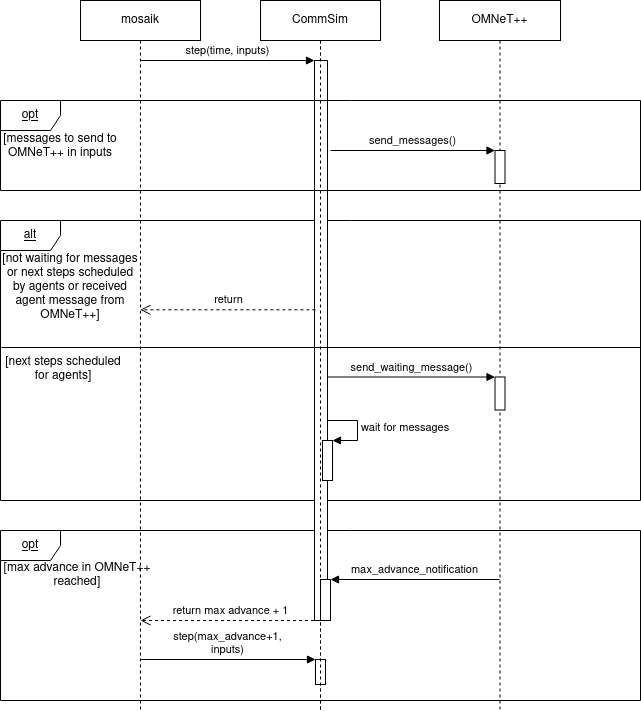

# CommunicationSimulator ([CommSimm](../cosima_core/simulators/core/comm_simulator.py))
To understand the role of the CommSim, the meaning of the max advance
value and the concept of the synchronization between OMNeT++ and mosaik is
useful. Explanations of these can be found in ([Synchronisation](Synchronization.md)).

## Concept
The CommSim is the interface to OMNeT++ for simulators from python and 
therefore the connection between mosaik and OMNeT++. It takes messages from
mosaik simulators, sends them to OMNeT++ and receives messages from OMNeT++
which it then forwards to the corresponding mosaik simulators.
The CommSim saves an instance of the class ([OmnetppConnection](../cosima_core/simulators/core/omnetpp_connection.py)),
which opens up TCP-Connection to OMNeT++ and is used to send and receive messages to and from OMNeT++.
This instance keeps an active connection to OMNeT++ and waits for messages independently of the step logic of mosaik.
This way, messages that arrive while the CommSim is not in its step function (so while another simulator is in step function) will still be considered.
Whenever a message is received from OMNeT++, the class OmnetppConnection stores the message in a list which
is accessible by the CommSim.

## Operating Principle
If a message should be sent to OMNeT++, the CommSim receives this message from other
simulators by mosaik in the step-function as input. The message is then send by the
instance of the OmnetppConnection, which sends the message via the opened
TCP connection.
All simulators connected to the CommSim always step first and send their messages.
The CommSim receives these messages from other simulators one mosaik step 
later and therefore after all the steps of other simulators.
Thus, it is ensured that the CommSim considers all messages from other simulators in its step.

When the CommSim steps, it also checks whether there are messages in the list
in the OmnetppConnection, so if there are some messages from OMNeT++ which
should be forwarded to mosaik simulators. If this is the case, the CommSim 
takes the messages and sends them to the corresponding receivers of the 
messages through mosaik. This is done by sending the messaging via the 
get_data-method from mosaik.
The CommSim is furthermore responsible for the synchronization to OMNeT++. 
It therefore checks in its mosaik-step after sending the received messages to 
OMNeT++, whether it should wait for further messages from OMNeT++ or not. It
always counts the number of agent messages sent to OMNeT++ and received from
OMNeT++. Therefore, it can determine, whether there are currently still 
messages simulated in OMNeT++. This means that there are still relevant messages for
the agent simulators. 
The CommSim furthermore checks whether to 
directly stop its mosaik step or should be actively waiting for messages from 
OMNeT++. The agent therefore always send their next scheduled step (if there 
is such) to the CommSim. The CommSim stores the next steps of the agents and
can always determine whether there are such. If there are no events scheduled
in mosaik by the agents but still messages being simulated in OMNeT++, the
CommSim actively waits for the agent messages to be completely simulated in OMNeT++.
When the simulated messages are then being sent back to mosaik, this might
cause further events (messages) from the receiving agent of the simulated message.

## Step function
An example simulation step of the CommSim could look like this. 

* If the CommSim has messages in its inputs in the step function from mosaik, 
it sends them to OMNeT++ via the class OmnetppConnection.
* If the CommSim received a message for any of the agents, it directly ends
its step and sends the message to the receiving agent by its get-data-method.
* If there are no further messages being simulated in OMNeT++, the CommSim does
not wait for any messages from OMNeT++ and it ends its step.
* If there are still messages being simulated in OMNeT++, the CommSim waits for 
these messages, it checks whether the next step is
determined by the agents. If this is the case, the CommSim directly ends its
step to make sure these actions of the actions are simulated.
* If the next step is not determined by the agents, the CommSim sends a 
*WaitingMessage* (see [Message Types](Message Types.md)) to OMNeT++, 
to point out to OMNeT++ that the mosaik-side is still waiting for messages. 
After that, the CommSim is actively waiting until a message was received from
OMNeT++ (either an AgentMessage, a message to point out a synchronization point
is reached from OMNeT++ (see [Synchronization](Synchronization.md)) or an 
error message). If a message from OMNeT++ which is pointing out that max 
advance is reached was received, the CommSim ends its step and tells mosaik that 
its next step will be one step after the time for max advance (therefore max advance + 1). Therefore, it is 
ensured that the event in mosaik which influenced the max advance value has 
taken place. The CommSim continues to wait for messages from OMNeT++ afterwards.
