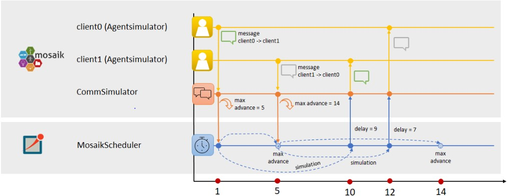

# Synchronization of OMNeT++ and mosaik
To explain the synchronization between mosaik and OMNeT++, it is necessary to
introduce some concepts.

* ***max advance* value from mosaik** \
The max advance value from mosaik is relevant for the synchronization.
For further information, see
[Max advance in mosaik](https://mosaik.readthedocs.io/en/latest/scheduler.html?highlight=max%20advance#how-far-is-a-simulator-allowed-to-advance-its-time) and [Explanation of step function in mosaik](https://mosaik.readthedocs.io/en/latest/mosaik-api/high-level.html?highlight=max%20advance#mosaik_api.Simulator.step).
The max advance value tells a mosaik simulator how far in advance it can step
in time with no scheduled event, which can influence the
step or input of the current simulator. 
Each simulator receives the current max advance value in its step function. 
In a concrete example, if two agent simulators are connected to the CommSim and the CommSim steps in time
step 0 with max advance value 2, the CommSim can be sure that there is no
scheduled event for the agents until then. Therefore, until time 2 there are no 
other events scheduled which can influence the step of the CommSim.

* ***until* value from mosaik** \
When running a mosaik scenario, the end of the simulation is set with the value
until. This value is set in simulation time units. It can therefore be used to determine the end of the simulation.
For further information see [until value mosaik](https://mosaik.readthedocs.io/en/latest/api_reference/mosaik.scenario.html?highlight=until#mosaik.scenario.World.run).

* **Next step values of AgentSimulators** \
The agents always tell the CommSim when their next steps will happen. The CommSim stores
these agents steps in a list. Since the max advance value from mosaik just tells
the simulator that there is a scheduled event at the given time, it does not have the information about 
which simulator causes the event otherwise.
It is necessary that the CommSim receives this information since there might be 
some events which are not caused by the agents and therefore not relevant to 
consider by the CommSim. Given the information about the next steps of the agents,
it can therefore always determine whether there are still other scheduled events
from the agents which have to be simulated, and
it can also distinguish between the events caused by agents
and other events.

## Message Exchange between OMNeT++ and mosaik
The idea of the synchronization concept is that mosaik always adapts to the time in 
OMNeT++. It is only possible, that the time in OMNeT++ has progressed further than
in mosaik, not vice versa. Therefore, it is necessary, that OMNeT++ considers 
all scheduled events on the mosaik side which are relevant on the communication
simulation.
Synchronization points between OMNeT++ and mosaik are the following:
* sending messages from mosaik to OMNeT++
* max advance events
* simulated messages in OMNeT++ reach their destination (sending messages from OMNeT++ to mosaik)
* the simulation end is reached (either in mosaik or in OMNeT++)

### Sending messages from mosaik to OMNeT++
Whenever a message is sent to OMNeT++ from mosaik, this message contains the current simulation time in mosaik. 
In OMNeT++, the MosaikScheduler which receives the message checks whether this time in mosaik
has not progressed further than the simulation time in OMNeT++. If this is the case, no synchronization error is there and the event is scheduled for the
given mosaik time. Therefore, the clocks in OMNeT++ and mosaik are synchronized. If the time in mosaik
has already progressed further, there would be a synchronization error.

### Max Advance Events
Whenever a message is sent from the mosaik-side to the OMNeT++ 
(from [CommSim](CommSim.md) to [MosaikScheduler](MosaikScheduler.md)), the max advance value 
the CommSim receives from mosaik in this step is also
sent to OMNeT++. Within OMNeT++, this value is taken and inserted as an event for the 
given max advance time. Whenever the time of such max advance event is reached, OMNeT++ pauses
and synchronizes with mosaik. This ensures that the simulation does not skip any events scheduled
in mosaik and that the time in OMNeT++ is not ahead the time in mosaik.

### Simulated messages in OMNeT++ reach their destination (sending messages from OMNeT++ to mosaik)
Whenever a message reaches the receiver module of the message in OMNeT++, it can be sent back to mosaik.
This is done by the MosaikScheduler. The current time in OMNeT++, which is the time when the message reached its
destination, will be added to the message which will be sent back to mosaik. When the CommSim receives the message in
mosaik, it checks whether the time in mosaik has not advanced further than the time in the message.
If this is the case, the times are synchronized and the CommSim sends the received message(s)
 from OMNeT++ for the given time in the message to the corresponding mosaik simulator.
This way, the clock in mosaik and the clock and OMNeT++ are synchronized. If the
time in mosaik has advanced further than the time in the message, there would be an error in the synchronization.

### The simulation end is reached (either in mosaik or in OMNeT++)
The simulation end is reached when the time of the simulation end set in the 
mosaik scenario (*until*) is reached in OMNeT++ or in mosaik. In this case, no further events 
are scheduled and the simulation will be stopped.

## Example scenario to explain the synchronization
The following example shows the synchronization in a scenario with two AgentSimulators
(*client0* and *client1*). In this example, client0 sends a message to 
client1 in step 1 and client1 sends a message to client0 in step 5.

* **Time step 1**
  * In the first step, client0 sends a message. This message is 
forwarded via mosaik to the CommSim. The max advance value for this time is 5,
because there is an event scheduled in mosaik (the message client1 
wants to send in step 5).
  * The CommSim sends the message with the max advance information to the MosaikScheduler.
  * Within OMNeT++, the MosaikScheduler receives the message and inserts an event for the 
given max advance time. The event will be triggered at time 5 and the MosaikScheduler will then
synchronize again with mosaik. Furthermore, the MosaikScheduler starts to simulate the received message from mosaik via the OMNeT++ network.
* **Time step 5** 
  * In step 5, the max advance event is reached in OMNeT++. The MosaikScheduler
  synchronizes with the CommSim again. Therefore, the CommSim becomes active
  again.
  * *Client1* steps in this time and sends its message to the CommSim. The new
  max advance information for the CommSim is step 14 because another event is
  scheduled in mosaik then (it could be that for example client1 wants to 
  send another message then or that the simulation end / until value is reached then).
  The CommSim sends the message from client1 in step 5 to the MosaikScheduler.
  * The MosaikScheduler again takes the information about max advance and
  schedules an event for the time of the max advance value to synchronize then again with mosaik.
  Furthermore, it starts simulating the new message through the OMNeT++ network.
  Note that there is still the first message being simulated in the network.
* **Time step 10**
  * In Step 10, the message from client0 which was sent in step 1 has
  reached its destination (thus with a delay of 9 time steps).
  Therefore, the MosaikScheduler synchronizes with mosaik again and sends the
  message to mosaik.
  * The CommSim takes the message and sends it to the
  corresponding receiver of the message (the corresponding agent in mosaik),
  which in this case is client1. 
  * In the meantime, the simulation in OMNeT++ continues because there
  is still a message being simulated.
* **Time step 12**
  * Now the second message (the one from client1 which was sent in
  step 5) reaches its destination in OMNeT++ (thus with a delay of 7). The
  MosaikScheduler now sends this message to the CommSim.
  * The CommSim forwards the message to the receiver, which is client0.
  * At the current state, no agent did send any other message at this time
  and also there is no message left to simulate in OMNeT++.
* **Time step 14** 
  * The next synchronization point would then be step 14 because the max
  advance event was scheduled in OMNeT++ for this time. As described above, the
  reason for this max advance event could have been a scheduled step for any agent 
  or the until time, therefore the simulation end, being reached.

